# Git的使用
---

## 实验目的
1. 学习 Git 软件的安装
2. 学习 Git 的简单使用，增加文件，提交，创建分支，增加远程，下拉、上推，合并

## 实验平台
- Window 10
- Git
- MarkdownPad2

## 实验前准备
1. 到官网http://10.21.49.130/other/git/Git-2.11.0-64-bit.exe下载 Git。
2. 翻阅相关资料，掌握分布式版本控制系统 Git 的基础知识。
3. 查找 Git 的使用教程，熟悉 Git 命令以及 Git GUI 的使用。

## 实验内容
### GIT的安装流程

#### 阅读软件许可
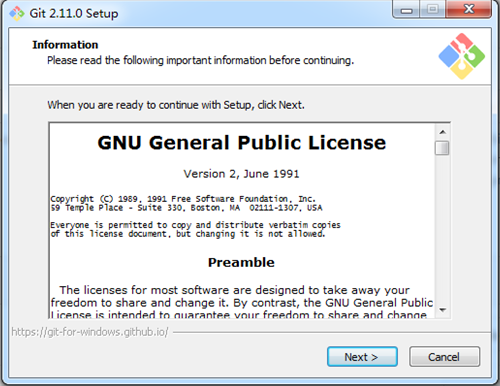

阅读完并点击 next 进行下一步安装。

#### 选择安装的组件
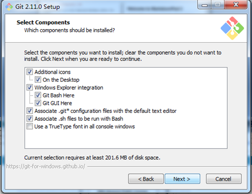

我们可以选择：

1. 在桌面添加快捷键图标
2. 在右键菜单中添加"Git Bash Here"和"Git GUI Here"，这样我们可以在任意文件路径中通过右键菜单打开 Git
3. 关联 .git 和 .sh 文件到 Git

#### 设置路径环境变量
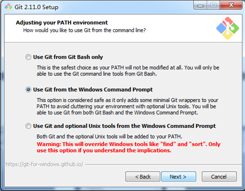

我们可以选择配置可以在 window 的 cmd 使用 Git 的命令，而不一定必须通过 Git Bash来使用。

#### 选择换行格式
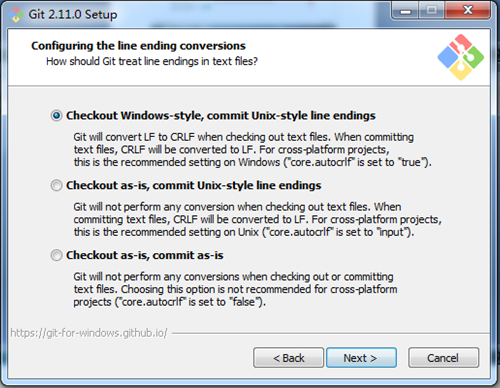

#### 配置 Git Bash 打开的终端
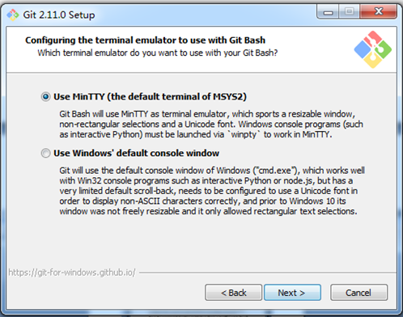

#### 配置额外的选项
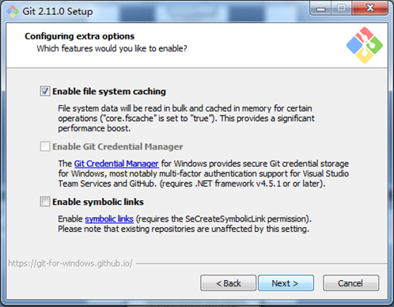

我们可以选择启用文件系统缓存。

#### 配置实验性选项
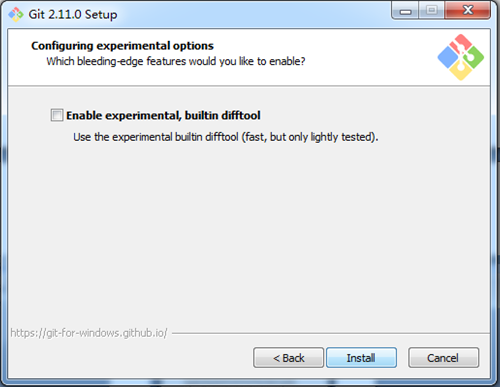

#### 焦急地等待安装
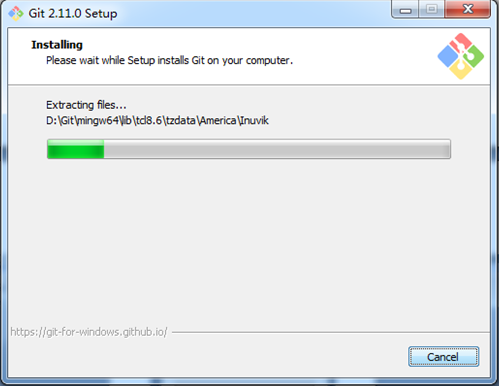

#### 最后，安装成功
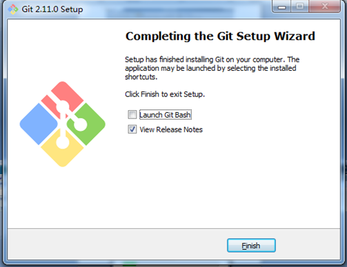

等待安装完后，我们可以在之后的界面选择立即启动 Git Bash和 查看当前的版本说明。

### Git 的使用
#### 练习使用git

1. 首先我们建立一个文件夹，文件夹命名为"学号+姓名+体系结构"

2. 右键打开git bash Here开始git学习之旅
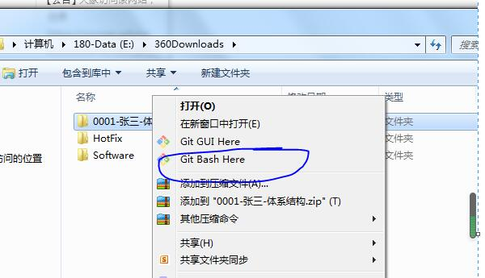

#### Git 的提交
1.在Edit->Options中编辑自己的个人信息
 
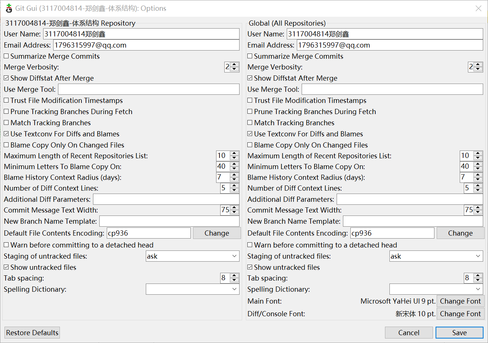

2.我们这时候在文件夹中新增一些内容，然后点击文件名前的图标移动到下半部分窗口，然后直接点击 Commit,会发现 Commit失败,这是因为我们没有输入我们的提交信息。正确的使用方法应该在右下角的文本框中输入提交的信息，如图所示：
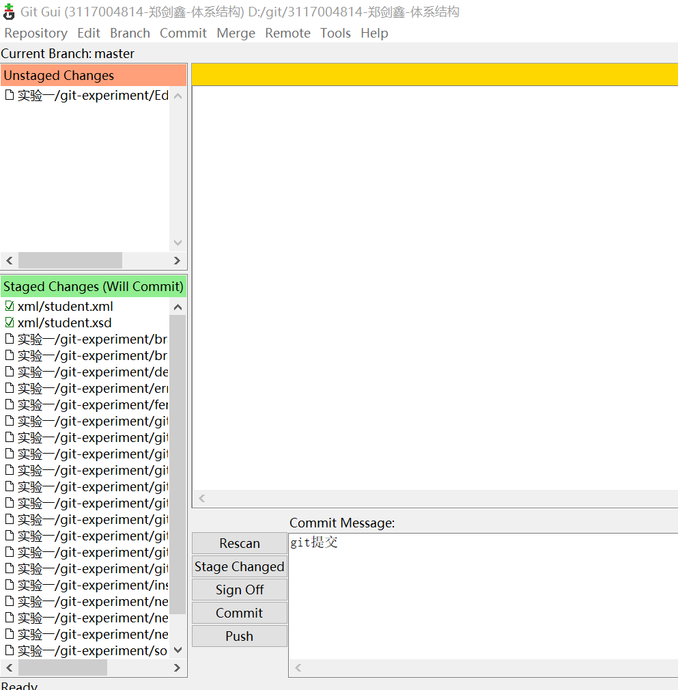

3.如果我们没有填写 Commit Message，则会出现下列错误。
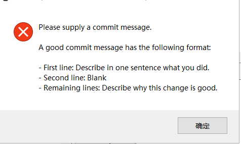

4.我们可以在文件夹中的.gitignore文件中输入一些内容，使其忽略一些文件，如下图：第一行，忽略 所有 bak类型文件，第2行，忽略 bin 目录第5行，忽略 Debug 或 debug 目录。
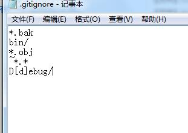

#### 分支管理
1. 在历史中，任意选择一个历史点，鼠标右键，选择  create new branch,创建一个分支测试，分支最好不要起中文名字，回到git gui，输入提交信息“分支测试”，再到我们的历史中，可以看到我们创建出了新的分支
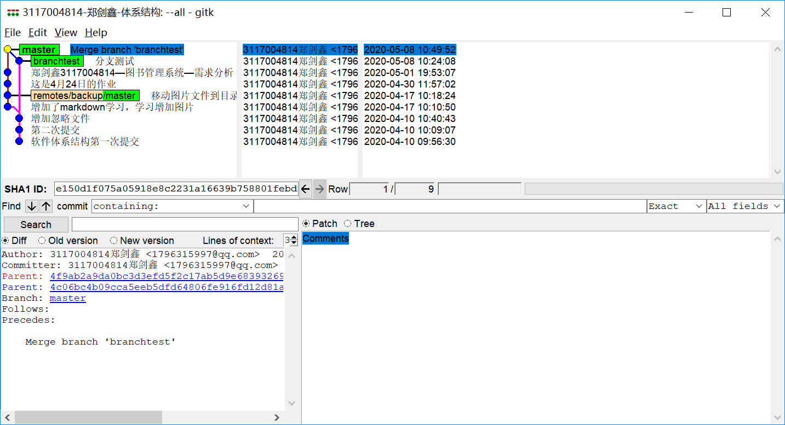
2. 合并分支，点击菜单Merge Local Merge,注意：合并分支前，所有的分支必须是干净的。

3. 增加两个新的分支
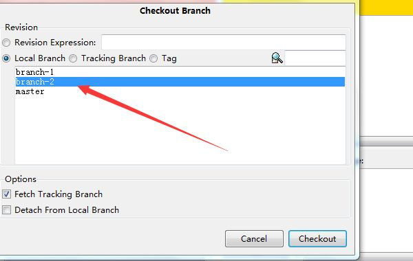
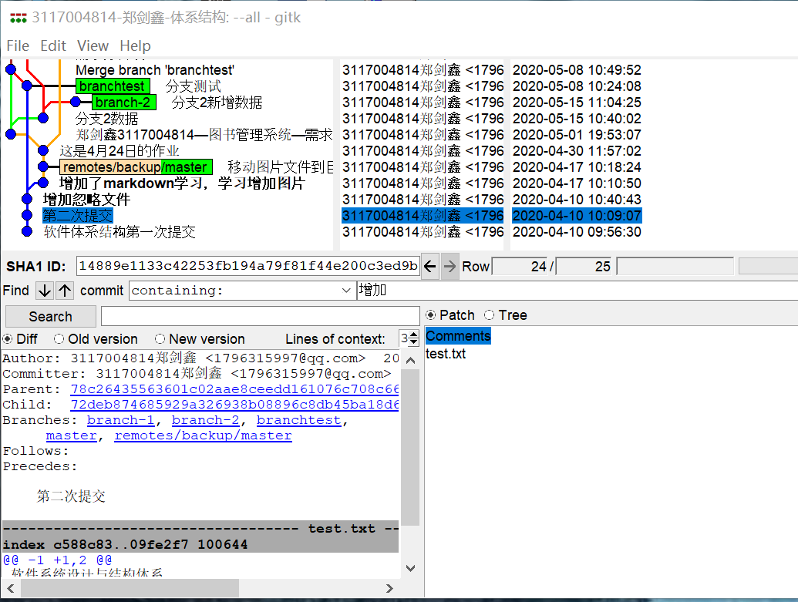
4. 处理分支冲突，在不同分支创建相同的文件，合并分支时会出错error-TwoSameBranch
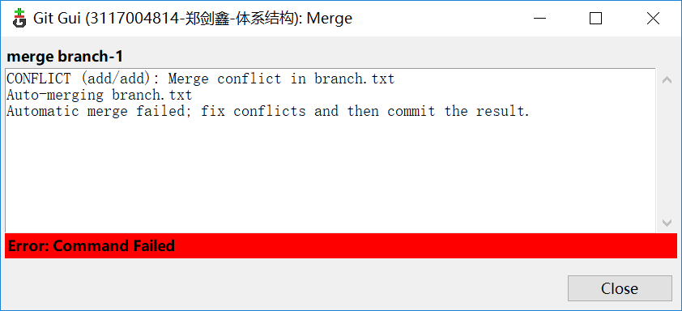
5. 处理分支冲突时，打开冲突的文件branch，会发现文件中多了一些符号<<<<======>>>>>>>
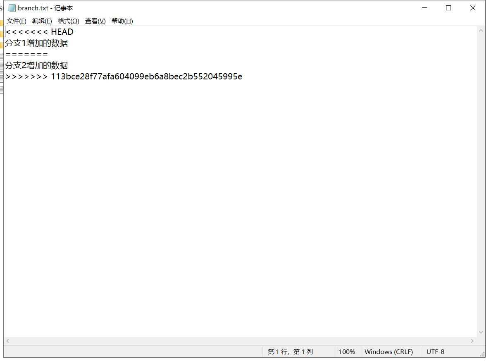
6. 处理冲突的方法是由合并的人自己解决，手动决定要什么内容，删除什么内容，决定好之后便可以把分隔符删除，再次提交，查看历史图，会发现又合并到一块了
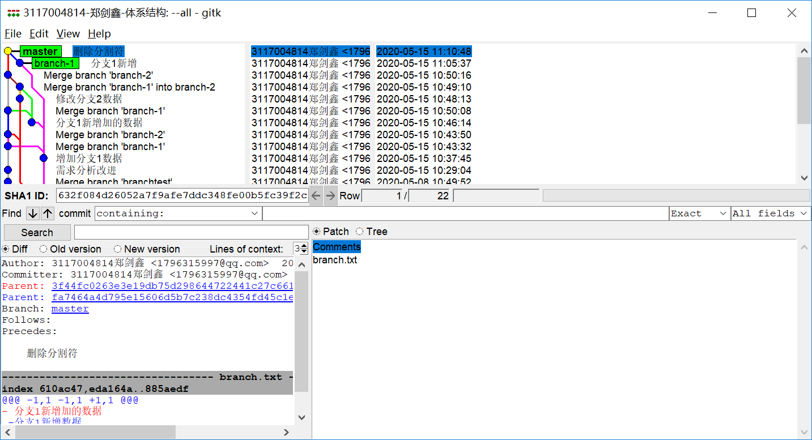

## 实验总结
在以前的编码开发实践过程中只是一味的追求代码功能，并未对自己的代码开发过程进行较为深入的研究探讨，对许多问题的解决都没有做系统的记录，而且在对代码的改进过程也没有做一些保留记录，自从通过郝老师的软件系统设计与体系结构课程的学习后， 我学会了如何去使用git管理自己的项目，这对我来说是一个很大的进步。通过这门课程，我深入了解了git软件的使用方法，我在实验中初步掌握了Git 的简单使用，增加文件、提交、创建分支、增加远程、下拉、上推、合并，能比较熟悉地使用 Git 命令或者 Git GUI 对自己的仓库进行版本管理。
在实验过程中，我也遇到了很多问题，但其中让我印象最深也是较为主要的问题是合并分支时的冲突问题，学会去查看冲突信息，找到发生冲突的文件，并作出修改解决冲突，最后才能再次提交。

在实验中，结合课堂上学习到的理论知识，加以实践，加深了对理论知识的理解，确实在学习实践的过程中受益匪浅。