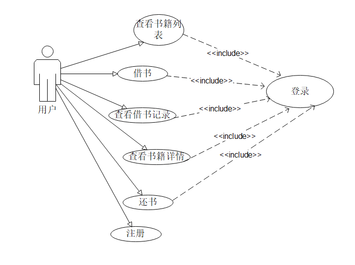
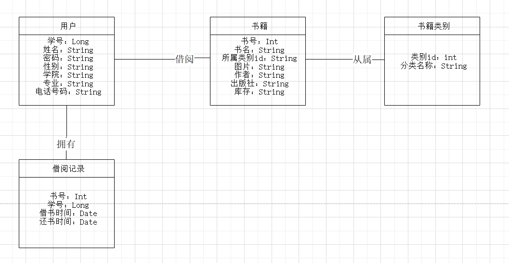

# 绪论（项目背景）

## 研究背景及意义
为了方便图书管理员及用户的操作，减少人为的工作量并使其能更有效的管理书库中的图书，实现了传统的图书管理工作的信息化建设。
意义：
1、准备和提供统一格式的信息，使各种统计工作简化，使信息成本最低。
2、及时全面地提供不同要求的、不同细度的信息，以期分析解释现象最快，及时产生正确的控制。
3、全面系统的保存大量的信息，并能很快的查询和综合，为组织的决策提出信息支持。
4、利用数学方法和各种模型处理信息，以期预测未来和科学地进行决策。
## 国内研究状况及分析
21世纪以计算机为主体的高新技术群体已经将触角深入到国家经济的方方面面。在市场经济的大环境下，越来越多的人士逐渐认识到计算机技术进行各类管理,交流的便捷。当前国内的图书管理系统都比较先进，比较符合当前状态下对图书管理系统的需求。当我们仍需防范于未然，对未来社会发展趋势做出预测，对图书管理系统做出升级改造，提高图书管理系统的性能，减少人为的工作量。

## 研究目标及关键技术简介
研究目标：
设计图书管理系统要求能做到以下四方面：
一、删除不必要的管理冗余，实现管理规范化、科学化。
二、程序代码标准化，软件统一化，确保软件的可维护性和实用性
三、能够连接各个关联的数据库，获取数据库中的信息。保证各个数据库表格相关的项目之间有相同的属性。
四、以通信功能作为界面设计的核心；界面友好、使用方便；具有较强的容错功能
关键技术：
数据库引用：mysql  
系统编译：Java
运行环境：Window 10
框架使用：maven+ssm框架（springmvc、spring、mybatis）
编译平台：eclipse
项目管理工具：git
# 需要分析
## 功能与性能需要分析
### 功能需要分析
####基本功能
需要实现以下功能
图书功能：
a 建立图书信息基本表
b 图书的增删改查
c 图书的借书还书记录
用户功能：
a建立用户基个人信息表
b 用户的增删改查
c 用户的借书还书记录
####用例图
用户端可以实现以下功能：登录、注册、首页展示、查看书籍列表、借书、还书、查看书籍详情、查看借书记录、信息回显
用例图如下

####系统的领域对象模型

### 性能需要分析
系统功能的基本性能要求：
用户可以通过账号密码登陆图书管理系统，且响应时间不得超过2秒
可以注册成为新用户，注册过程要按照提示信息，要是输入错误，会有信息回显，数据回显需及时
注册账户，检查用户信息中是否存在已有账号，若有，则无法再次注册
借书一次只能借一本，借书时会对比数据库中的现存库存，无论借书成不成功，都会返回提示信息
还书时会鉴别该书当前状态，归还书籍是否成功均会返回信息提示
点击图书图片，会跳转到该图书的详情页面，页面间的跳转应少于一秒
