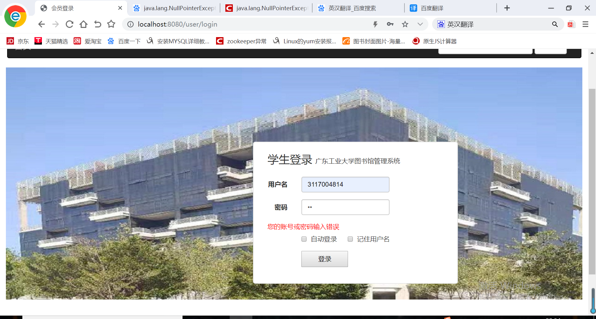
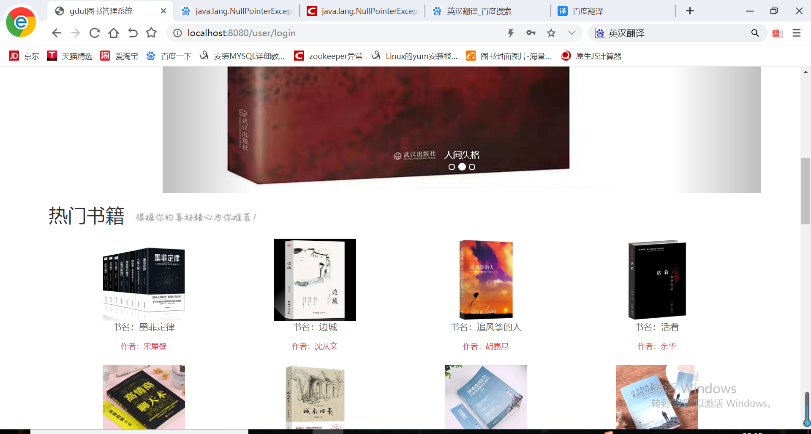
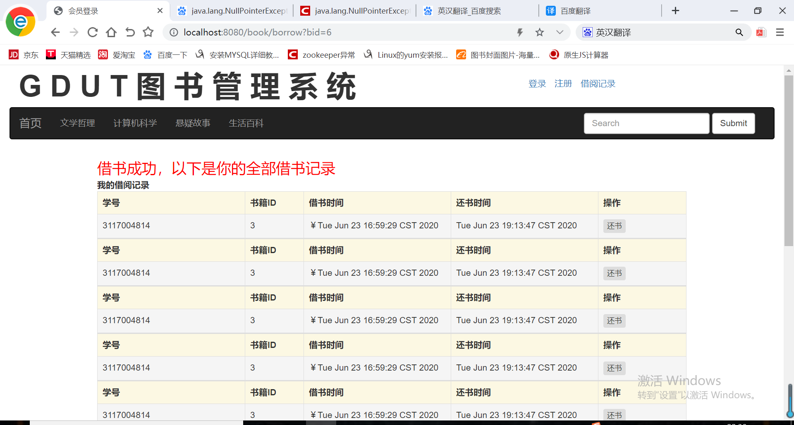
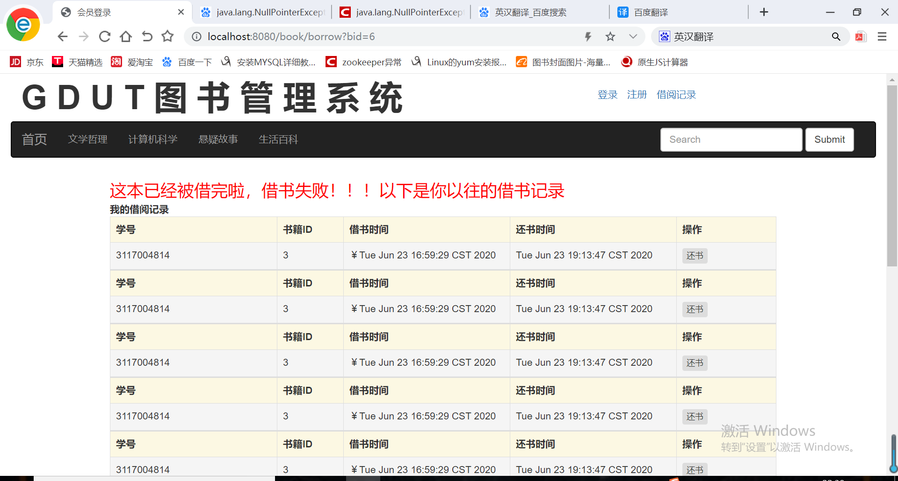
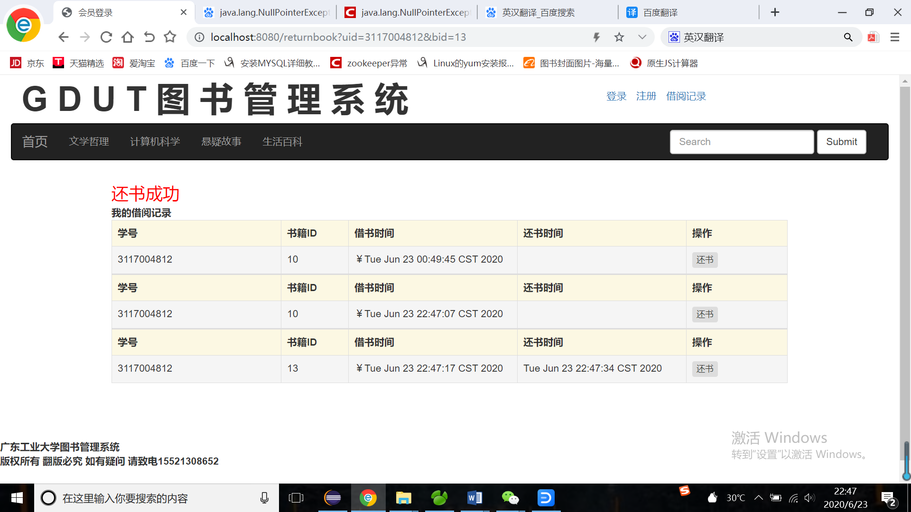
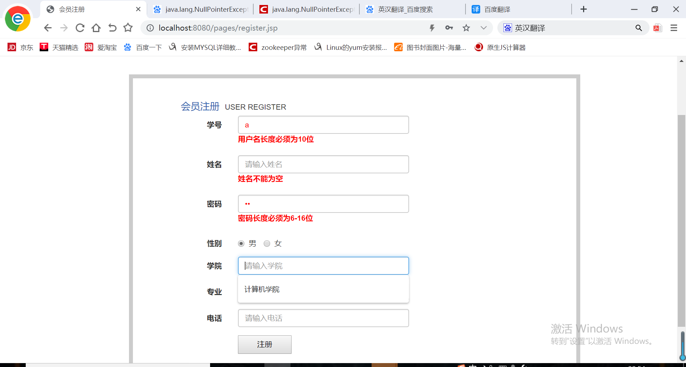

# 绪论（项目背景）

## 研究背景及意义
为了方便图书管理员及用户的操作，减少人为的工作量并使其能更有效的管理书库中的图书，实现了传统的图书管理工作的信息化建设。
意义：
1、准备和提供统一格式的信息，使各种统计工作简化，使信息成本最低。
2、及时全面地提供不同要求的、不同细度的信息，以期分析解释现象最快，及时产生正确的控制。
3、全面系统的保存大量的信息，并能很快的查询和综合，为组织的决策提出信息支持。
4、利用数学方法和各种模型处理信息，以期预测未来和科学地进行决策。
## 国内研究状况及分析
21世纪以计算机为主体的高新技术群体已经将触角深入到国家经济的方方面面。在市场经济的大环境下，越来越多的人士逐渐认识到计算机技术进行各类管理,交流的便捷。当前国内的图书管理系统都比较先进，比较符合当前状态下对图书管理系统的需求。当我们仍需防范于未然，对未来社会发展趋势做出预测，对图书管理系统做出升级改造，提高图书管理系统的性能，减少人为的工作量。

## 研究目标及关键技术简介
研究目标：
设计图书管理系统要求能做到以下四方面：
一、删除不必要的管理冗余，实现管理规范化、科学化。
二、程序代码标准化，软件统一化，确保软件的可维护性和实用性
三、能够连接各个关联的数据库，获取数据库中的信息。保证各个数据库表格相关的项目之间有相同的属性。
四、以通信功能作为界面设计的核心；界面友好、使用方便；具有较强的容错功能
关键技术：
数据库引用：mysql  
系统编译：Java
运行环境：Window 10
框架使用：maven+ssm框架（springmvc、spring、mybatis）
编译平台：eclipse
项目管理工具：git
# 需要分析
## 功能与性能需要分析
### 功能需要分析
####基本功能
需要实现以下功能
图书功能：
a 建立图书信息基本表
b 图书的增删改查
c 图书的借书还书记录
用户功能：
a建立用户基个人信息表
b 用户的增删改查
c 用户的借书还书记录
####用例图
用户端可以实现以下功能：登录、注册、首页展示、查看书籍列表、借书、还书、查看书籍详情、查看借书记录、信息回显
用例图如下

####系统的领域对象模型

### 性能需要分析
系统功能的基本性能要求：
用户可以通过账号密码登陆图书管理系统，且响应时间不得超过2秒
可以注册成为新用户，注册过程要按照提示信息，要是输入错误，会有信息回显，数据回显需及时
注册账户，检查用户信息中是否存在已有账号，若有，则无法再次注册
借书一次只能借一本，借书时会对比数据库中的现存库存，无论借书成不成功，都会返回提示信息
还书时会鉴别该书当前状态，归还书籍是否成功均会返回信息提示
点击图书图片，会跳转到该图书的详情页面，页面间的跳转应少于一秒
# 总体设计
## 系统框架选择及设计
### ssm框架简述
本系统将采用ssm框架（spring、springmvc、mybatis）设计图书管理系统，使用ssm框架对图书管理系统进行开发有很多方面的好处
主要从以下三个方面叙述：

1.Spring的优势:
通过Spring的IOC特性，将对象之间的依赖关系交给了Spring控制，方便解耦，简化了开发
通过Spring的AOP特性，对重复模块进行集中，实现事务，日志，权限的控制

提供了对其他优秀开源框架的集成支持

2.Spring MVC的优势:
SpringMVC是使用了MVC设计思想的轻量级web框架，对web层进行解耦，使我们开发更简洁
与Spring无缝衔接
灵活的数据验证，格式化，数据绑定机制

3.Mybatis的优势:
数据库的操作(sql)采用xml文件配置，解除了sql和代码的耦合
提供映射标签，支持对象和和数据库orm字段关系的映射，支持对象关系映射标签，支持对象关系的组建
提供了xml标签，支持动态的sql
### 功能模块设计
1. 登陆认证模块
将输入的账号及密码与数据库中已有的账号密码进行匹配，如果不匹配，则跳转到登录界面，并返回错误提示信息，若成功匹配，则跳转到书籍列表首页
2. 注册模块
将输入的账号与数据库中已用的账号进行匹配，若数据库已有该账号，则不能再次进行注册
3. 查看书籍列表
可以查看所有的书籍，也可以按照书籍类别ID查看相对应的书籍
4. 查看图书详细信息
可以查看图书的详细信息，可以在此页面进行借书
5. 借书模块
点击借书按钮即可开始借书，系统会检测书籍是否可借并返回对应的信息提示，若借书成功会更新借书信息表以及书籍信息表
6. 还书模块
点击借书按钮即可开始借书，系统会检测书籍是否可借并返回对应的信息提示，若借书成功会更新借书信息表以及书籍信息表

### 系统流程图

## 系统模块（或类）设计
###关键数据结构
实体类
1.学生信息表：学号，密码，姓名，性别、学院、专业、电话号码（学号为主码） 
2.书单信息表：书号，图片、书名，所属图书类别、作者、出版社，书的当前库存（书号为主码）
3.借书表：借书人的学号，书号，借书时间，还书时间
4.书籍类别表：类别ID，类别名称
边界类类图

###总体设计的顺序图及类图
1.顺序图

2.类图

3.逻辑模型设计：将E-R图转换为关系模式（模式名后加上自己的学号和姓名）。
 1.学生信息表：学号，密码，姓名，性别、学院、专业、电话号码 
2.书单信息表：书号，图片、书名，所属图书类别、作者、出版社，书的当前库存
3.借书表：借书人的学号，书号，借书时间，还书时间
4.书籍类别表：类别ID，类别名称
# 详细设计

## UI设计
本系统将使用前后端交互的方式来设计图书管理系统，前端用bootstrap框架设计，界面美观，且能与后台数据进行较为友好的交互
## 数据库设计
本系统采用Mysql数据库，创建的数据库名称为book。
1.Book（图书信息表）

2.Users (用户信息表)

3.Borrowitems表(图书借阅记录表)

4.category表（书籍类别信息表）

数据的存放位置设计由系统应用情况特设计如下存储方式，所有的表由于信息量大且使用频繁将其存储在高速存储器（硬盘）上。将表存储在不同的磁盘上以便提高查询效率，同时这样可以提高物理I/O读写效率。数据库备份文件和日志文件等文件因为使用频率小而且数据量非常大，存放在低速存储设备上。
## 详细设计的顺序图

# 编码实现
以下将列出我主要功能的实现代码，由于代码太多，只挑登录功能的代码列举出来
这是web模块的

	@RequestMapping(value = "/user/login", method = RequestMethod.POST)
	@ResponseBody
	public ModelAndView checklogin(HttpServletRequest request,HttpServletResponse response,HttpSession session) throws Exception {
		ModelAndView mv=new ModelAndView();
		String upassword=request.getParameter("upassword");
		Long uid=Long.parseLong(request.getParameter("uid"));
		boolean isExist=userService.findUser(uid,upassword);
	
		if(isExist==true) {
			session.setAttribute("uid", uid);
			mv.addObject("msg", " ");
			List<Book> IndexBoolist=bookService.getIndexbook();
			mv.addObject("IndexBoolist", IndexBoolist);
			List<Category> categoryList=categoryService.getname();
			mv.addObject("categoryList", categoryList);
			mv.setViewName("index");
			return mv;
		}else {
			mv.addObject("msg", "您的账号或密码输入错误");
			mv.setViewName("login");
			return mv;
		}
		
		
	}
这是service模块的

	@Override
	public Boolean findUser(Long uid, String upassword) {
		// TODO Auto-generated method stub
		
		UsersExample example=new UsersExample();
		Criteria criteria=example.createCriteria();
		criteria.andUidEqualTo(uid);
		List<Users> user=usersMapper.selectByExample(example);
		
		if(user==null||user.size()==0) {
			return false;
		}
		Users users=user.get(0);
		if(!users.getUpassword().equals(upassword)) {
			return false;
		}
		return true;
		
	}

# 测试和部署 

## 软件功能测试
以下将对每个功能模块进行测试
1.用户登录界面
如下图所示，是用户登录界面的实现效果

若密码错误，则会弹出提示信息您的账号或密码输入错误

登录成功后会进入首页界面（首页实现了轮播图和图书列表
2.首页

3.点击图书的图片，会进入图书详情页

4.点击借书，可查询当前书库中的书的库存并返回借书结果信息，并跳转到我的借阅页面
a.借书成功时提示借书成功，以下是你的全部借书记录

b.借书失败时提示这本已经被借完啦，借书失败！！！以下是你以往的借书记录

5.每一个页面的头部有相关按钮，每一个按钮都可以跳转到相关的页面

6.要是还书时，点击还书按钮即可进行还书，返回提示信息并跳转回原页面

7.用户注册时，会给予提示信息，注册内容有误会回显错误信息

## 集成测试
经过测试发现，当用户进行借书还书，或者登录注册时，数据库均能及时对数据进行更新，此图书管理系统美中不足的是，一次借书只能借一本，同种类型的也只能借一本
# 结论与展望

## 结论
这次课程设计经历了从选题、目录、摘要、前言、系统设计、需求分析到E-R图设计，再到关系模型设计，最后建立数据库。在这其中我通过查阅相关书籍，进行了很多次大大小小的扩充和修改，使数据库结构和内容更趋于完善。
本次设计的图书管理系统，在我看来还是十分简陋的，其中很多功能还有待完善，比如登陆界面，我起初的想法是分为两种登陆方式，一种为管理员登陆方式，一种为学生登陆方式，但由于时间关系，未能实现我的最初想法，此系统算是比较简陋的。
## 展望
在接下来的日子里，我会争取把他完善，增加其他图书管理功能，使得此系统更加完善，还将尝试用不同的编程语言对其进行设计，争取设计出界面良好，功能完善，代码精简的图书管理系统。同时在设计程序的过程中，对程序的UI和用户的交互也要花更多的精力在这里面，使用户得到更好的体验。
# 致谢
我衷心感谢郝彦军老师，在软件系统设计与体系结构的学习中，孜孜不倦，通过上课期间手把手的教学使得我们对git各个功能有了深刻的认识，在接下来的图书管理系统设计及项目管理中给我提供了鼎力支持。非常感谢老师的孜孜教诲。

