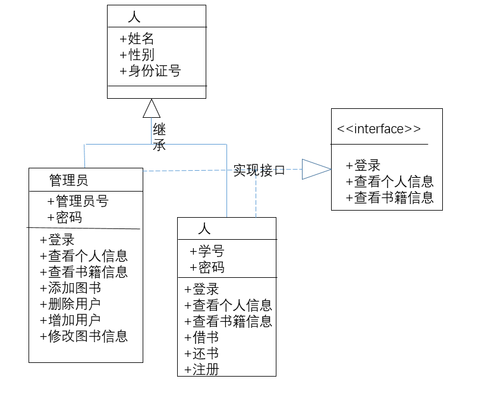
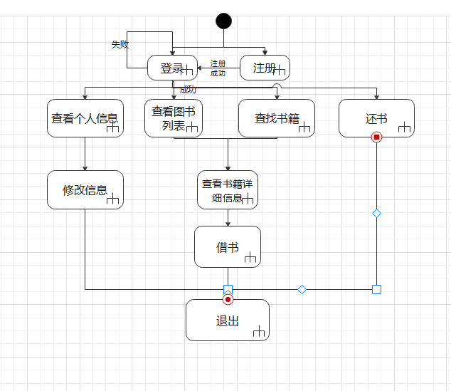

#需求分析
##功能需求
图书管理系统是典型的计算机信息管理系统，通过将图书馆的各种功能进行整合，从而达到显示检索信息，提高工作效率，降低管理成本等目标，在现阶段的图书管理系统计中，本图书管理系统的用户端提供了六个功能，分别是登录功能，注册功能，查看个人信息功能，查看书籍信息功能，借书功能以及还书功能。
###用例图
设计成用例图如下所示：

###E-R图
总体ER图

局部E-R图（用户）

局部E-R图（图书）

局部E-R图（出版社）

###数据字典
####用户数据字典

|数据项名|数据项含义|别名|数据类型|取值范围|取值含义|
|:----|----|----|----|----|----|
|Sno|每个学生对应一个唯一的标识|学号|char(8)|10000000-99999999|第一位代表学士学位，第二位代表性别，第三四位代表哪年入学，第五至八位代表学生序号|
|Sname|每个学生自己的称呼|姓名|char|一般为两至三位汉字|第一位代表姓氏，第二、三位代表名字|
|Ssex|每个人自出生带有的属性|性别|char|一个字|代表学生的属性是男是女|
|Sp|每个学生设置的可以对应学号防止泄露信息的一串由数字、字母和符号组成的编码|密码|char|不限|  -|
|Sid|国家为每个人指定的一串可以识别身份信息的字符串|身份证号|char（18）|18个数字或17个数字与一个字母|前6位为出生地，7-14位为出生日期后四位为随机数|
####图书数据字典
|数据项名|数据项含义|别名|数据类型|取值范围|取值含义|
|:----|----|----|----|----|----|
|Bno|每本书对应一个唯一的标识|书号|char(8)|10000000-99999999|-|
|Bname|作者为自己的作品起的名字|书名|char|一般由一至多个字符组成|可以总体概况书的内容|
|Bborrow|由系统统计的被借走的频率|被借次数|char|0-10000000|能够反映这本书的被借走的频率|
|Bstate|当前书是否还在图书馆中|当前状态|char|0或1|1代表可借，0代表不可借|
####出版社数据字典
|数据项名|数据项含义|别名|数据类型|取值范围|取值含义|
|:----|----|----|----|----|----|
|Pno|每个出版社对应一个唯一的标识|出版社号|char|由字母与数字组成|代表地名以及坐标|
|Pname|出版社独特的标识|出版社名|char|一般由地名加上出版社|可以大致反映出版社所处位置|
|Paddress|表示出版社的具体位置|地址|char|-|-|
|Ptel|每个出版社特有的联系方式|电话|char|有多位数字组成的字符串|-|
##类图
	
##动态图
	

