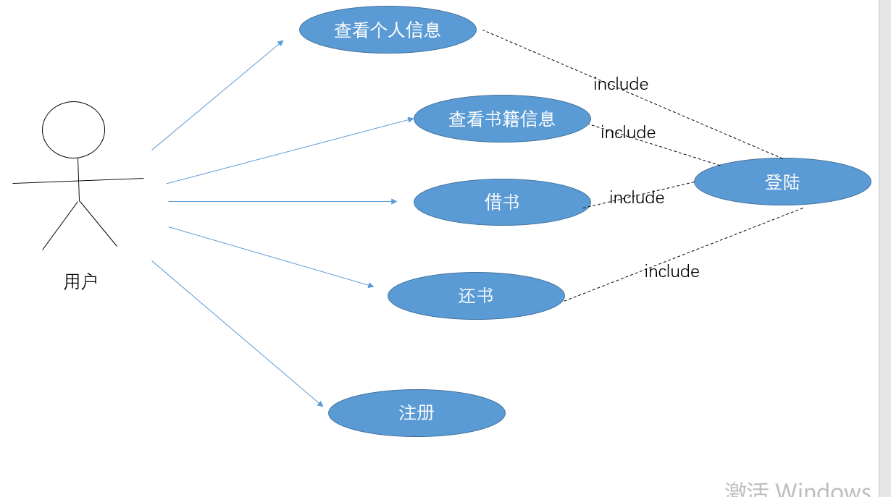
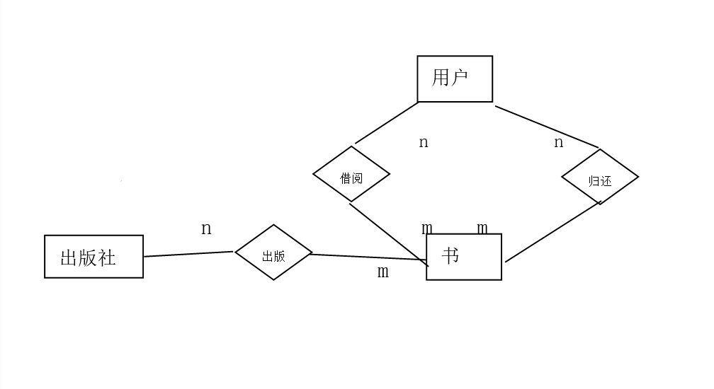
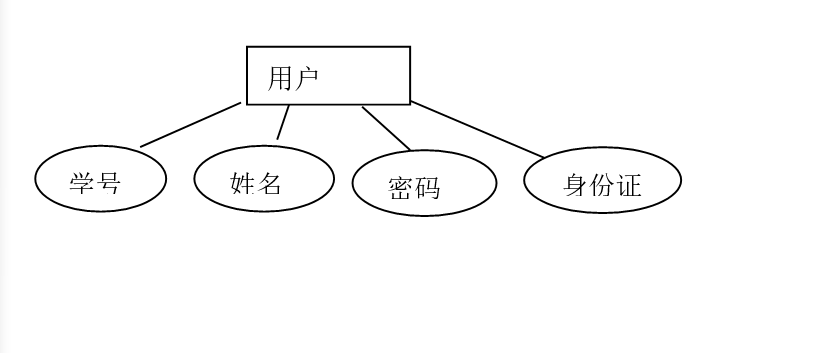
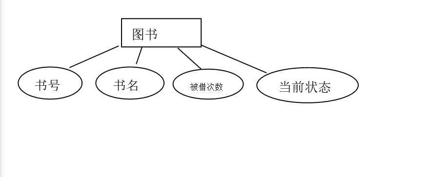
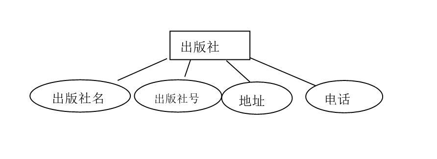

#需求分析
##功能需求
图书管理系统是典型的计算机信息管理系统，通过将图书馆的各种功能进行整合，从而达到显示检索信息，提高工作效率，降低管理成本等目标，在现阶段的图书管理系统计中，本图书管理系统的用户端提供了六个功能，分别是登录功能，注册功能，查看个人信息功能，查看书籍信息功能，借书功能以及还书功能。
###用例图
设计成用例图如下所示：

###E-R图
总体ER图

局部E-R图（用户）

局部E-R图（图书）

局部E-R图（出版社）

